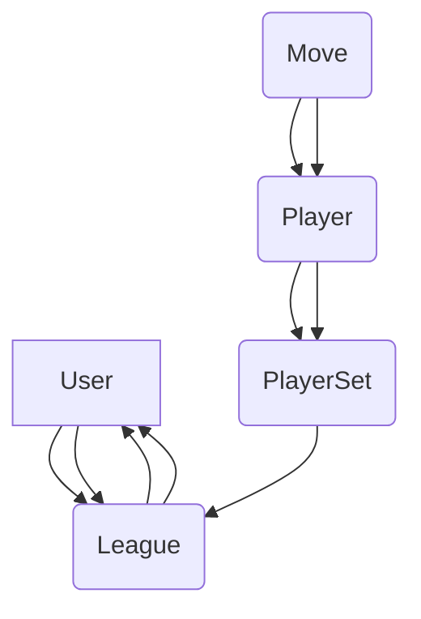

# Data Model Overview
## Description
A leagues is made up of
## Overview

```mermaid
graph TD;
    A[User] --> B(League)
    A --> B
    B --> A
    B --> A
    C(Player) --> D
    C --> D
    E(Move) --> C
    E --> C
    D(PlayerSet) --> B
```

## Details

```mermaid
erDiagram
    auth_user ||--|{ users_leagues : email
    auth_user {
        int id
        string first_name
        string last_name
        string email
        string password
        string registration_key
        string reset_password_key
        string registration_key
    }
    users_leagues ||--|{ league : id
    users_leagues {
        int id
        int league_id
        int user_id
    }
    league ||--|{ player_set: id
    league {
        int id
        int player_set_id
        bool drafted
        int commish_id
        string name
    }
    player_set ||--|{ players_player_sets : id
    player_set {
        int id
        string name
    }
    players_player_sets ||--|{ player : id
    players_player_sets {
        int player_set_id
        int player_id
    }
    player ||--|{ players_moves : id
    player {
        int id
        string name
        string image_path
    }
    players_moves ||--|{ move : id
    players_moves {
        int player_id
        int move_id
    }
    move
    move {
        int id
        string name
        int cost
        int accuracy
        int basePower
        string category
        string isNonstandard
        int pp
        int priority
        int critRatio
        string target
        string type
    }
```

